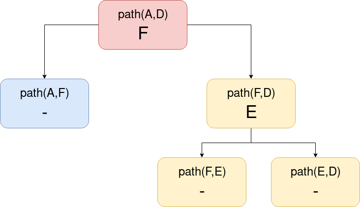

# Exercise 1

We apply **Dijkstra's algorithm** to calculate the minimum cost path from node C to any other node in G, being G(V, E, W) a graph. We initialize the cost vector D[^1], the path vector P[^2] and the set of visited nodes S.[^3]

| it | S | w | A | B | C | D | E | F | G | H | A | B | C | D | E | F | G | H |
|:-:|:-:|:-:|:-:|:-:|:-:|:-:|:-:|:-:|:-:|:-:|:-:|:-:|:-:|:-:|:-:|:-:|:-:|:-:|
| 1 | C | - | INF | 1 | 0 | INF | INF | INF | 6 | 2 | - | C | - | - | - | - | C | C |
| 2 | B, C | B | 3 | 1 | 0 | 6 | INF | INF | 6 | 2 | B | C | - | B | - | - | C | C |
| 3 | B, C, H | H | 3 | 1 | 0 | 6 | INF | INF | 3 | 2 | B | C | - | B | - | - | H | C |
| 4 | A, B, C, H | A | 3 | 1 | 0 | 6 | INF | INF | 3 | 2 | B | C | - | B | - | - | H | C |
| 5 | A, B, C, G, H | G | 3 | 1 | 0 | 6 | INF | 5 | 3 | 2 | B | C | - | B | - | G | H | C |
| 6 | A, B, C, F, G, H | F | 3 | 1 | 0 | 6 | 6 | 5 | 3 | 2 | B | C | - | B | F | G | H | C |
| 7 | A, B, C, D, F, G, H | D | 3 | 1 | 0 | 6 | 6 | 5 | 3 | 2 | B | C | - | B | F | G | H | C |
| 8 | A, B, C, D, E, F, G, H | E | 3 | 1 | 0 | 6 | 6 | 5 | 3 | 2 | B | C | - | B | F | G | H | C |

[^1]: D vector is the first to appear in the table shown (from the two vectors).
[^2]: P vector is the last to appear in the table shown.
[^3]: We also show *w*, which represents the current pivot.

## Path from C to D

There exists a path between node *C* and node *D*, because we can see that in the *D* vector that the cost of going from *C* to *D* is not infinite.

The **cost** of going from *C* to *D* is **6**, and the **minimum-cost path** will be **C->B->D**. 

For getting the path we need to check the *P* vector, which indicates the previous node that we need to visit in order to get to node *D*, that is node *B*. Finally, we check that to go to *B* we need to depart from node *C*, and because it's the starting node, we have completed the minimum-cost path.

## Path from C to E

There exists a path between node *C* and node *E*, because we can observe that in the *D* vector that the cost of going from *C* to *E* is not infinite.

The **cost** of going from *C* to *E* is **6** as well, and the **minimum-cost path** will be **C->H->G->F->E**.

For getting the path we need to execute the same steps explained in the previous question.

## Path from A to E

We don't know if there is a path between nodes *A* and *E* because Dijkstra's algorithm was executed for node *C*, not *A*.

# Exercise 2

In this exercise we were asked to indicate whether there is a path between the following nodes and explain why we have reached that conclusion. If the path exists, we must reconstruct it showing each step of the iterartion.

## Path from C to B

There exists a path from *C* to *B* because we see in the *D* vector that the cost of going from *C* to *B* **is not infinite**.

The **cost** of going from *C* to *B* is **1**.

Next we calculate the **mininimum-cost pathway**:

- We go to vector *P* to check what is the previous node that we need to visit to be able to reach *B*, that is node *C*.
- As node *C* is the starting node, we finish the process.

The minimum-cost pathway will be **C->B**.

## Path from C to A

There does not exist a path between *C* and *A* because we see in the *D* vector that the cost of going from *C* to *A* **is infinite, which makes it unreachable**.

## Path from C to D

There exists a path from *C* to *D* because we check in the *D* vector that the cost of going from *C* to *D* **is not infinite**.

The **cost** of going from *C* to *D* is **7**.

Now we will obtain the **minimum-cost pathway**:

- We go to vector *P* to check what is the previous node that we need to visit to be able to reach *D*, that is node *E*.
- We do the same for node *E*, and we see that the previous node to *E* is node *F*.
- Again, we check the previous node to *F* which is *B*.
- Finally, we see that for going to *B* we must depart from the initial node *C*, so we stop the process.

The minimum-cost pathway will be **C->B->F->E->D**.

# Exercise 3

We apply the **Floyd-Warshall algorithm** to calculate the minimum-cost paths between every pair of nodes in G, being G(V, E, W) a graph. We define the cost matrix A and the path matrix P after the execution of the algorithm.

| A matrix | A | B | C | D | E | F | G | H |
|:-:|:-:|:-:|:-:|:-:|:-:|:-:|:-:|:-:|
| A | 0 | 1 | 4 | 8 | INF | 5 | INF | 2 |
| B | 1 | 0 | 5 | 9 | INF | 6 | 4 | 3 |
| C | 1 | 2 | 0 | 4 | INF | 1 | 4 | 3 |
| D | 2 | 1 | 3 | 0 | INF | 4 | 5 | 4 |
| E | 5 | 6 | 4 | 8 | 0 | 6 | 3 | 7 |
| F | INF | INF | INF | INF | INF | 0 | INF | INF |
| G | 2 | 3 | 1 | 5 | INF | 2 | 0 | 4 |
| H | 2 | 3 | 2 | 6 | INF | 3 | 1 | 0 |  

| P matrix | A | B | C | D | E | F | G | H |
|:-:|:-:|:-:|:-:|:-:|:-:|:-:|:-:|:-:|
| A | - | - | H | H | - | H | - | - |
| B | - | - | H | H | - | H | H | A |
| C | - | A | - | - | - | - | H | A |
| D | B | - | - | - | - | C | H | B |
| E | G | G | G | G | - | - | - | G |
| F | - | - | - | - | - | - | - | - |
| G | C | C | - | C | - | C | - | C |
| H | - | A | G | G | - | G | - | - |

## Path from H to A

There exists a path from node *H* to node *A*, because in the *A* matrix we can observe that the cost of going from *H* to *A* **is not infinite**.

The **cost** of going from *H* to *A* is **2**.

To calculate the minimum-cost path, we go to the *P* matrix and find that there is a direct path between node *H* and *A*, so the minimum-cost path will be **H->A**.

## Path from A to E

There does not exist a path from node *A* to node *E* because in the *A* matrix we can see that the cost of going from *A* to *E* **is infinite, and therefore unreachable**.

## Path from B to F

There exists a path from node *B* to node *F*, because we have checked that in the *A* matrix the cost of going from *B* to *F* **is not infinite**.

The **cost** of going from *B* to *F* is **6**.

The minimum-cost path will be **B->A->H->G->C->F**. The process of calculating it is shown in **Figure 1**.

{height=350px}

# Exercise 4

In this exercise we were required to indicate whether there is a path between the following nodes and why we have reached that conclusion. We also have to check whether drain or source nodes exist in the graph.

## Path from A to D

There exists a path from node *A* to node *D* given that in the *A* matrix we can observe that the cost of going from *A* to *D* **is not infinite**.

The **cost** of going from *A* to *D* is **9**.

The minimum-cost path will be **A->F->E->D**. The process of calculating the path is shown in **Figure 2**.

{height=350px}

## Path from E to F

There does not exist a path from node *E* to *F*, because the cost of going from *E* to *F* in the *A* matrix **is infinite, and therefore unreachable**.

## Path from F to C

There exists a path from node *F* to node *C* because in the *A* matrix the cost of going from *F* to *C* **is not infinite**.

The **cost** of going from *F* to *C* is **5**.

The minimum-cost path will be **F->C**, because in the *P* matrix we observe that a direct path exists between the two nodes.

## Drain nodes

There is a drain node in the graph, and that is **node A**, because it cannot be accessed from any other node in the graph, as seen in the *A* matrix.

## Source nodes

There is a source node in the graph, and that is **node D**, because it cannot travel to any other node in the graph, as seen in the *A* matrix.

# Exercise 5

In this last exercise we are given a graph G(V, E) and are asked to perform a **depth-first search** from the following departure nodes, showing the order in which the nodes would be visited step by step.

## From A

| it | Search order | Candidates |
|:-:|:-:|:-:|
| 1 | - | A |
| 2 | A | B,H |
| 3 | A,B | A,G,H,H |
| 4 | A,B | G,H |
| 5 | A,B,G | F,H,H |
| 6 | A,B,G,F | H,H |
| 7 | A,B,G,F,H | A,G,H |
| 8 | A,B,G,F,H | G,H |
| 9 | A,B,G,F,H | H |
| 10 | A,B,G,F,H | - |

As we can see, **from node *A* we cannot access all nodes of the graph**.

## From C

| it | Search order | Candidates |
|:-:|:-:|:-:|
| 1 | - | C |
| 2 | C | A,D,G |
| 3 | C,A | B,H,D,G |
| 4 | C,A,B | A,G,H,H,D,G |
| 5 | C,A,B | G,H,H,D,G |
| 6 | C,A,B,G | F,H,H,D,G |
| 7 | C,A,B,G,F | H,H,D,G |
| 8 | C,A,B,G,F,H | A,G,H,D,G |
| 9 | C,A,B,G,F,H | G,H,D,G |
| 10 | C,A,B,G,F,H | H,D,G |
| 11 | C,A,B,G,F,H | D,G |
| 12 | C,A,B,G,F,H,D | B,E,F,G |
| 13 | C,A,B,G,F,H,D | E,F,G |
| 14 | C,A,B,G,F,H,D,E | G,F,F,G |
| 15 | C,A,B,G,F,H,D,E | F,F,G |
| 16 | C,A,B,G,F,H,D,E | F,G |
| 17 | C,A,B,G,F,H,D,E | G |
| 18 | C,A,B,G,F,H,D,E | - |

From node *C* **we can access all nodes of the graph**.

## From D

| it | Search order | Candidates |
|:-:|:-:|:-:|
| 1 | - | D |
| 2 | D | B,E,F |
| 3 | D,B | A,G,H,E,F |
| 4 | D,B,A | B,H,G,H,E,F |
| 5 | D,B,A | H,G,H,E,F |
| 6 | D,B,A,H | A,G,G,H,E,F |
| 7 | D,B,A,H | G,G,H,E,F |
| 8 | D,B,A,H,G | F,G,H,E,F |
| 9 | D,B,A,H,G,F | G,H,E,F |
| 10 | D,B,A,H,G,F | H,E,F |
| 11 | D,B,A,H,G,F | E,F |
| 12 | D,B,A,H,G,F,E | G,F,F |
| 13 | D,B,A,H,G,F,E | F,F |
| 14 | D,B,A,H,G,F,E | F |
| 15 | D,B,A,H,G,F,E | - |

From node *D* **we cannot access all nodes of the graph**.

## From G

| it | Search order | Candidates |
|:-:|:-:|:-:|
| 1 | - | G |
| 2 | G | F |
| 3 | G,F | - |

From node *G* **we cannot access all nodes of the graph**.

