# Exercise 1

In this first exercise we have to add 38, 23, 56, 86, 75, 82, 47, 91, 51, 48, 15, 21 to an empty BST. We can see the result in **Figure 1**.

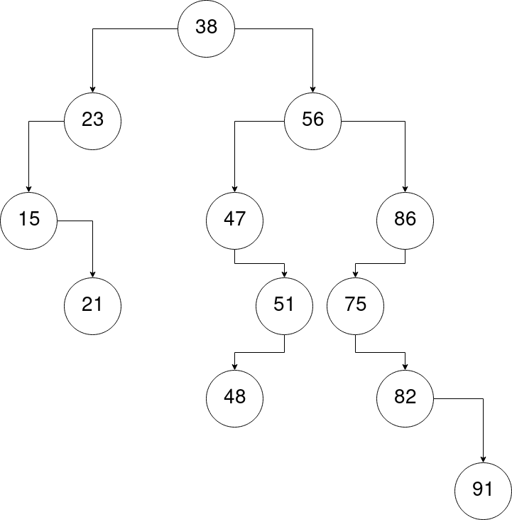{height=350px}

# Exercise 2

We are required to remove the nodes 31, 56, 84, 26, 39 from a given BST.

## Removing node 31

We first remove node 31. See **Figure 2**.

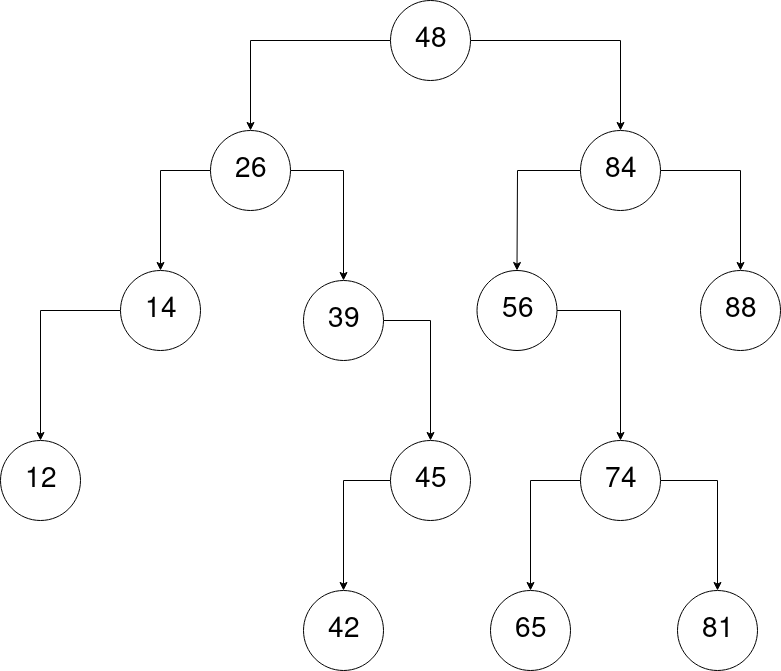{height=350px}

## Removing node 56

We then remove node 56. Now 74 becomes the left child of 84. See **Figure 3**.

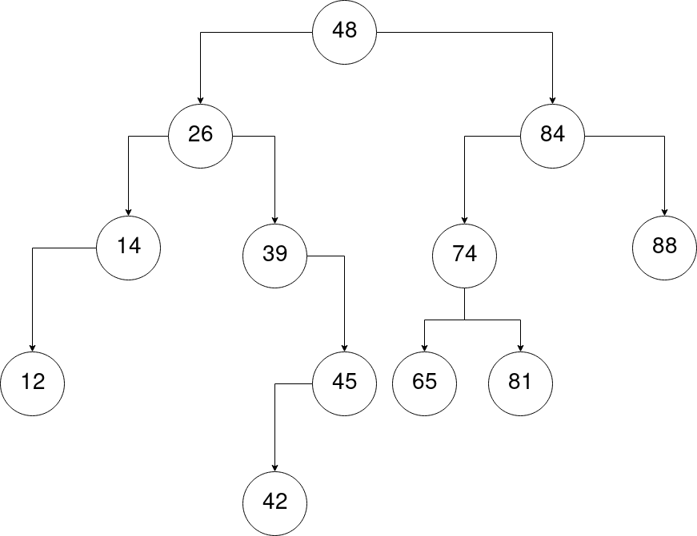{height=350px}

## Removing node 84

Now we remove node 84. 81 takes the place of 84. See **Figure 4**.

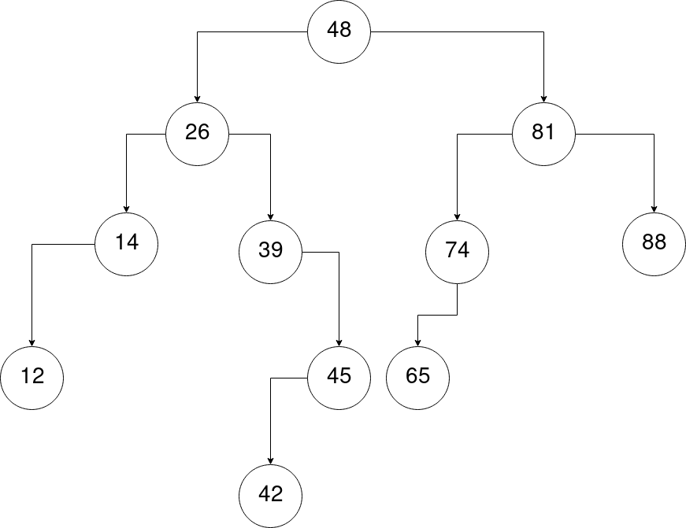{height=350px}

## Removing node 26

We now remove node 26. 14 takes the place of 26. See **Figure 5**.

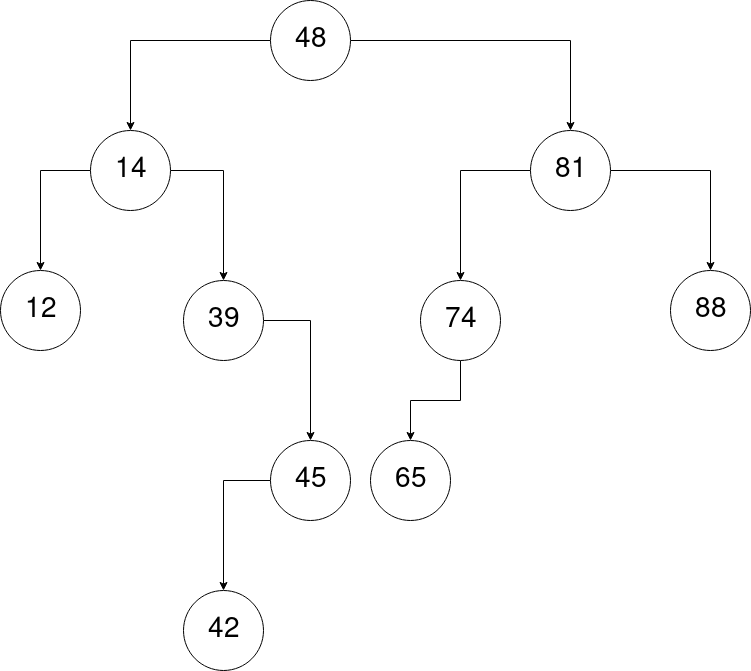{height=350px}

## Removing node 39

Lastly we remove node 39. 42 takes the place of 39. See **Figure 6**.

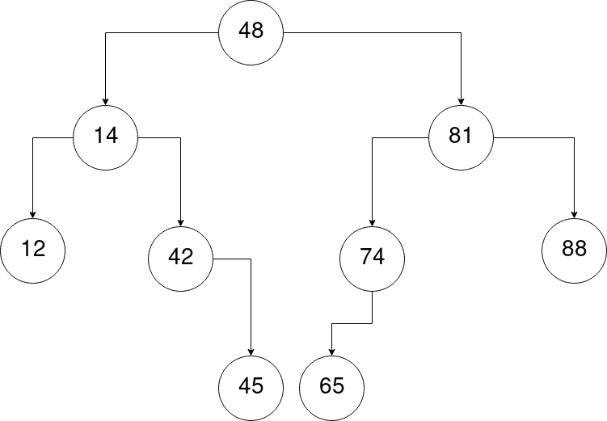{height=350px}

# Exercise 3

In this exercise we are asked to add the nodes 10, 20, 60, 30, 65, 40, 15, 14, 12, 11 to an AVL tree and show the height and balance factor of every node.

## Adding nodes 10, 20, 60

We first add nodes 10, 20 and 60. We need to perform a single right rotation. See **Figure 7**.

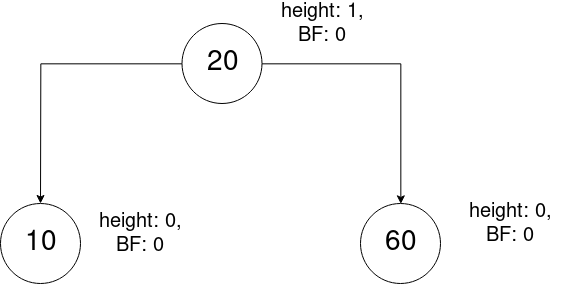{height=350px}

## Adding nodes 30, 65, 40

We then add nodes 30, 65 and 40. We perform a double right rotation and 30 becomes the new root. See **Figure 8**.

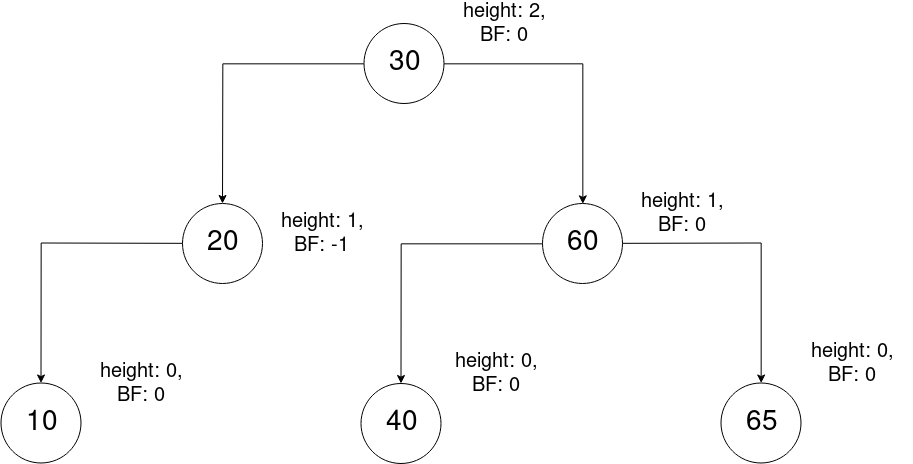{height=350px}

## Adding nodes 15, 14, 12, 11

Lastly we add nodes 15, 14, 12 and 11. We perform a double left rotation and 14 becomes the left child of 30. See **Figure 9**.

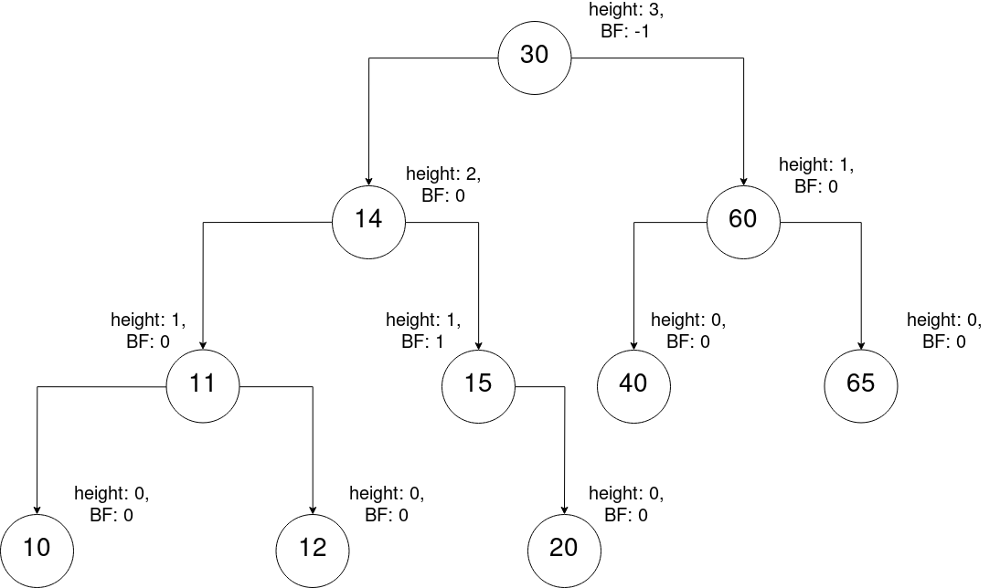{height=350px}

# Exercise 4

We are required to delete the nodes 46, 56, 87, 74 and 55 from an AVL tree.

## Removing node 46

We first remove node 46. See **Figure 10**.

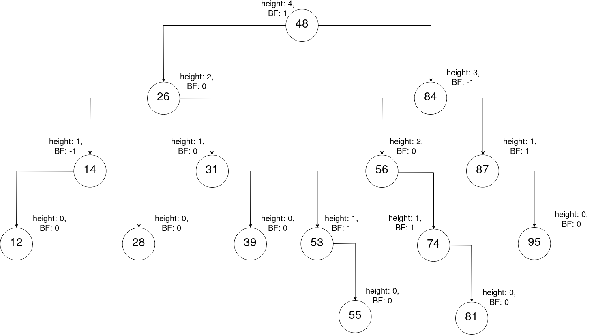{height=350px}

## Removing node 56

We then remove node 56. We perform a double left rotation and 55 takes the place of 56. See **Figure 11**.

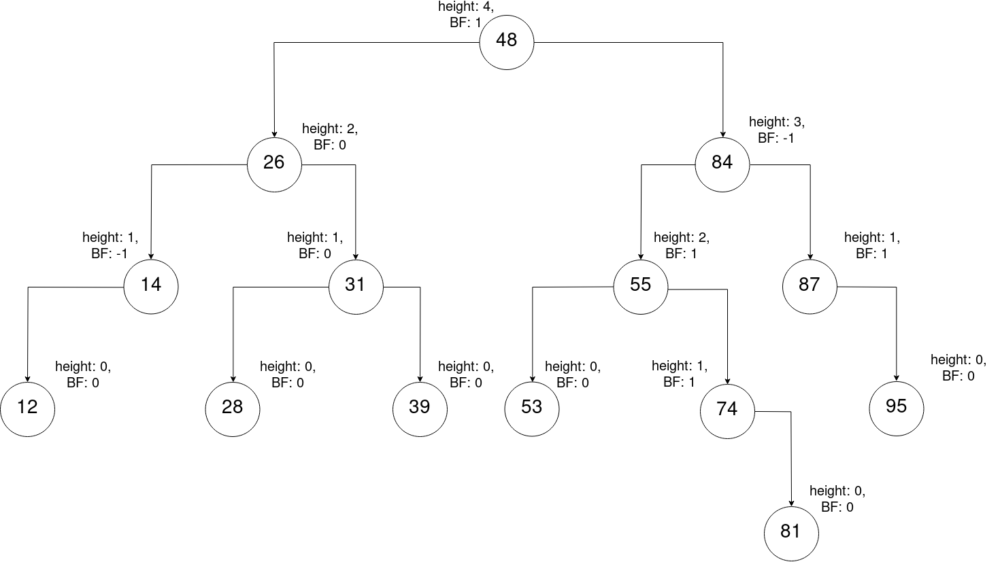{height=350px}

## Removing node 87

Now we remove node 87. We perform a double left rotation. See **Figure 12**.

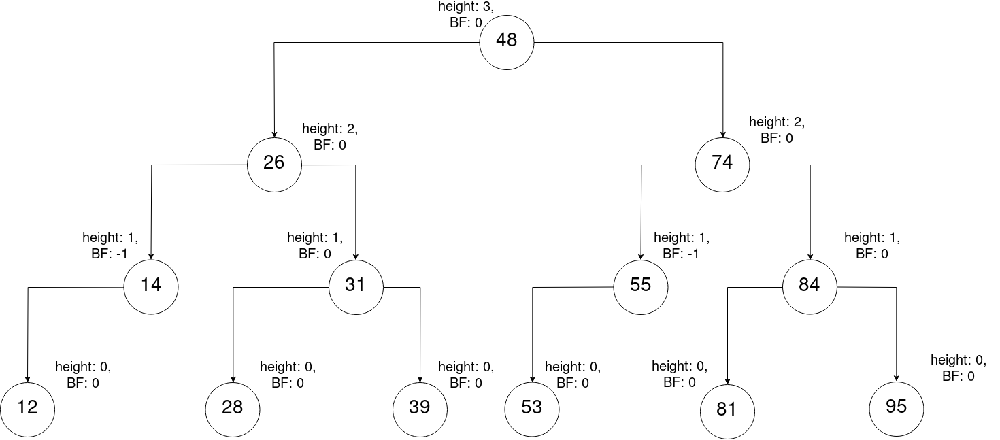{height=350px}

## Removing node 74

We now remove node 74. 55 takes its place. See **Figure 13**.

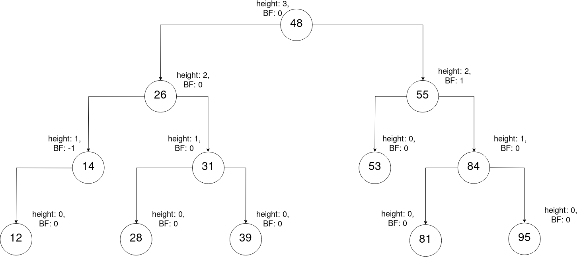{height=350px}

## Removing node 55

Lastly we remove node 55. We perform a double right rotation. See **Figure 14**.

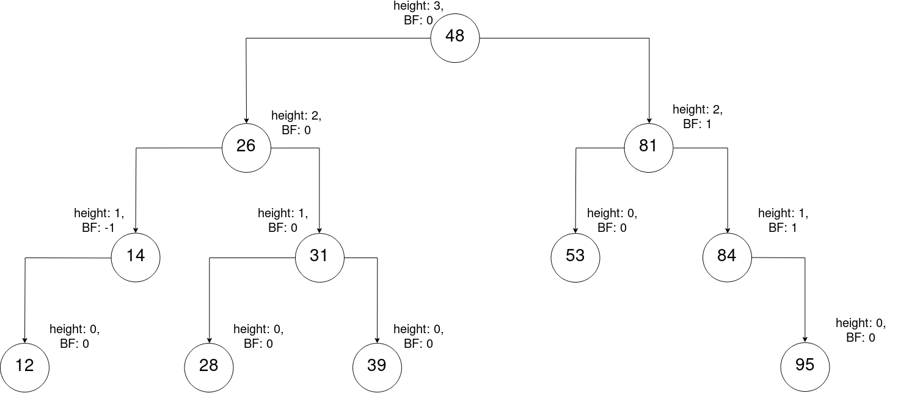{height=350px}

# Exercise 5

In this exercise we have to add the elements 13, 27, 56, 44, 22, 89, 18, 11, 35, 74, 60, 32 and 52 to a B Tree of order 3. See **Figures 15 and 16**.

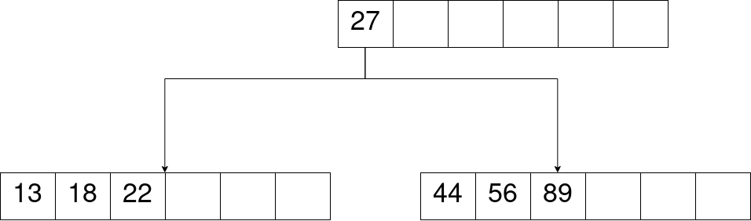{height=350px}

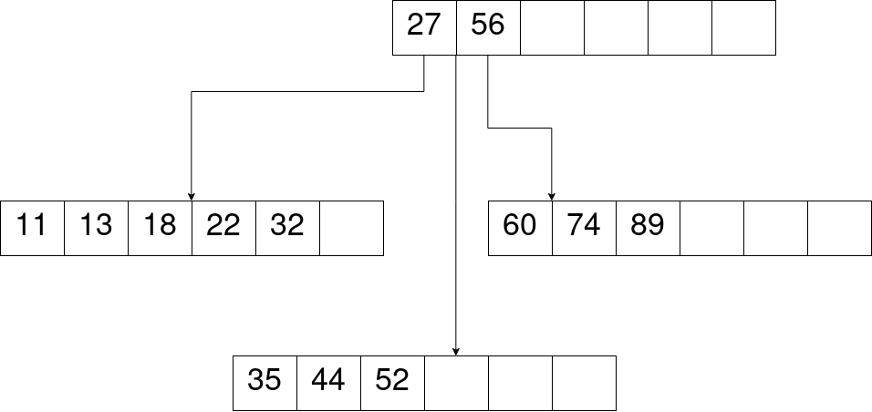{height=350px}

# Exercise 6

In the last exercise we are requested to delete the set of elements 78, 79, 82, 60, 45 and 74 from a B Tree of order 2.

## Removing element 78

We first remove element 78. 76 takes its place. See **Figure 17**.

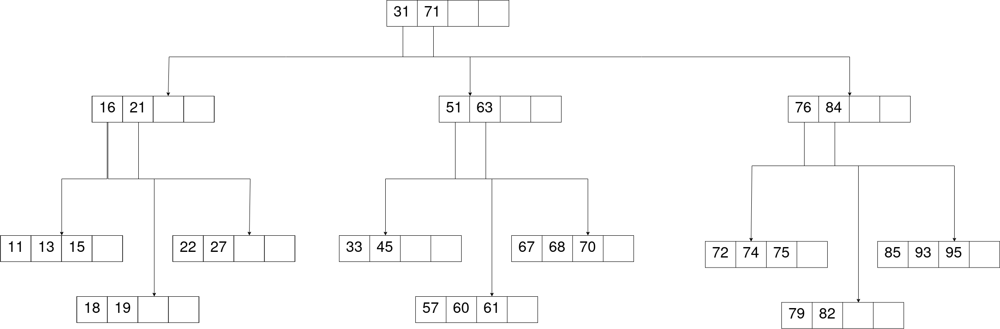{height=350px}

## Removing element 79

We then remove element 79. We transfer elements from the right leaf sibling. See **Figure 18**.

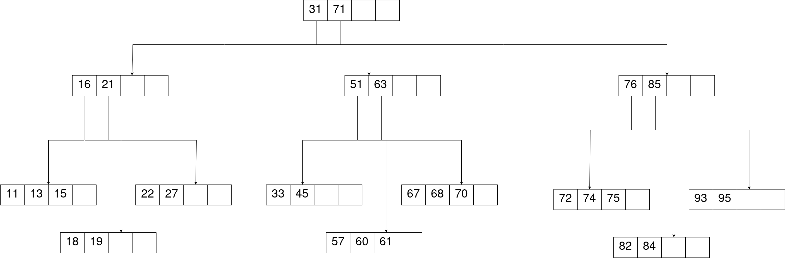{height=350px}

## Removing element 82

Now we remove element 82. We transfer elements from the left leaf sibling. See **Figure 19**.

{height=350px}

## Removing element 60

We now remove element 60. See **Figure 20**.

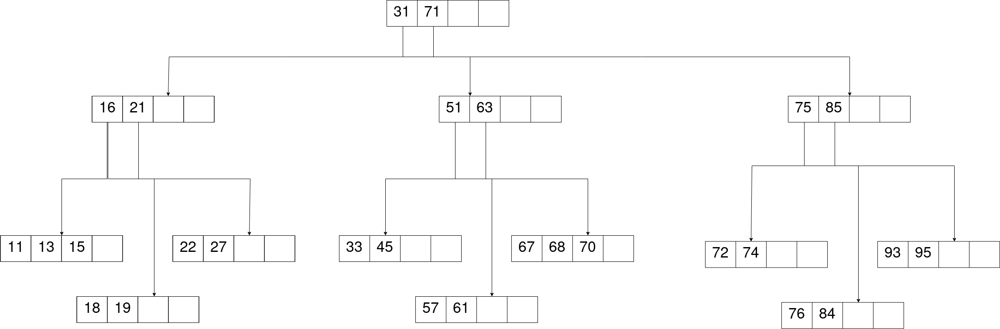{height=350px}

## Removing element 45

After that, we remove element 45. We merge both branches because of underflow. See **Figure 21**.

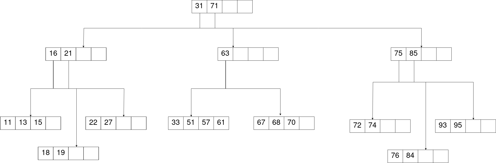{height=350px}

## Removing element 74

Lastly we remove element 74. We also merge both branches due to underflow. See **Figure 22**.

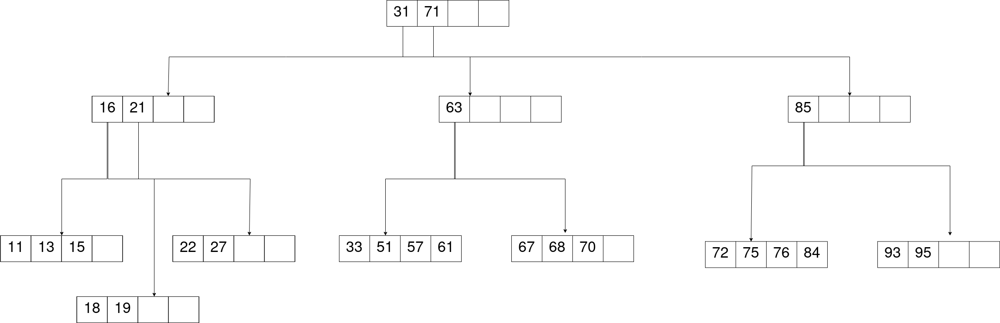{height=350px}

